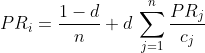
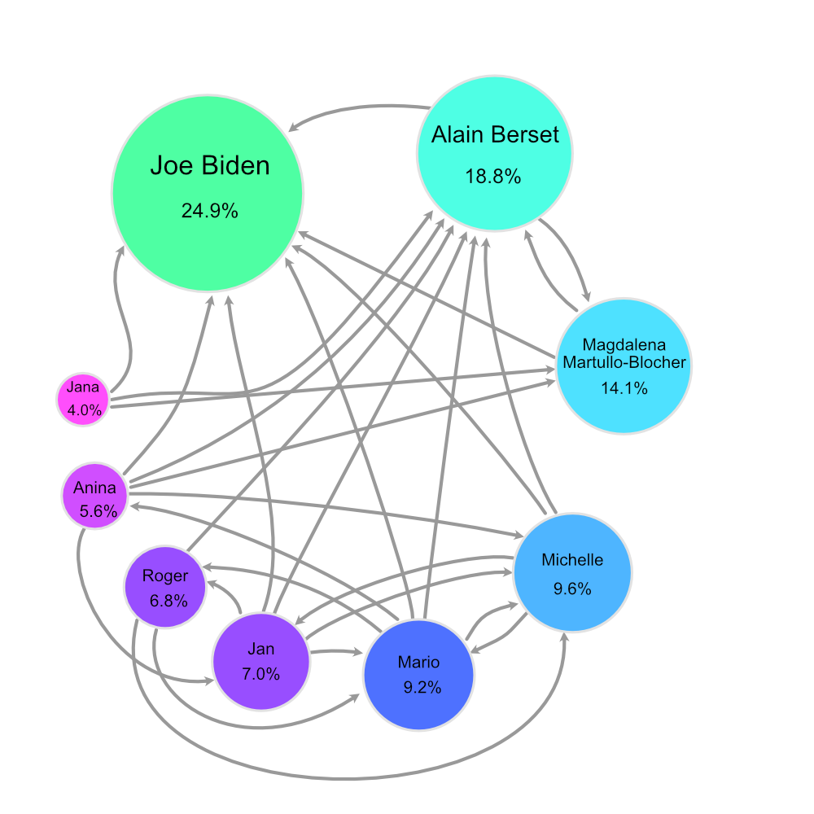

# bfh-page-rank

## Task a

*Create a simple representation in code of a Directed Graph with weighted nodes.*

### Implementation

Es wurden die Klassen *Vertex* und *Graph* erstelt, welche die Knoten und den Directed Graph darstellen. In der Klasse *TaskA* wurde ein Beispiel-Graph mit einigen Knoten und Kanten erstellt. Alle Knoten des Graphen werden auf `System.out` ausgegeben, gefolgt von der Ausgabe aller ausgehenden und eingehenden Kanten des Beispiel-Knoten `srf.ch`.

* Vertex: [Class Vertex](page-rank-fuhrj2/src/main/java/Vertex.java)
* Graph: [Class Graph](page-rank-fuhrj2/src/main/java/Graph.java)
* TaskA: [Class Main](page-rank-fuhrj2/src/main/java/Main.java#L4)

## Task b

*Describe in your own word and implement the algorithm for computing the page rank of a small example graph.*

### PageRank Algorithmus
Der PageRank-Algorithmus wurde von Larry Page und Sergei Brin an der Standford University entwickelt, 1997 wurde dieser patentiert. Der Algorithmus diente als Grundlage der Suchmaschiene Google für die Bewertung und Indexierung der einzelnen Webseiten. Die inhaltliche Qualität einer Webseite spielt jedoch keine Rolle.

**Aufbau**

Jede Webseite stellt einen Knoten mit einem Gewicht (PageRank) in einem *gewichteten Graphen* dar. Das Gewicht einer Seite wird umso grösser, desto mehr Seiten (mit einem möglichst hohem eigenen Gewicht) auf diese Seite verweisen. 
* Grundsätzlich wird somit eine Webseite mit vielen eingehenden Links höher gewichtet als eine mit wenigen. Ausschlaggebend ist jedoch auch das Gewicht der Seite, welche auf eine andere verlinkt. 
* Eine Seite wird besser bewertet, wenn wichtige andere Seiten auf diese verlinken.
* Das eigene Gewicht gibt die Seite anteilsmässig an alle verlinkenden Seiten weiter (Gewicht durch Anzahl ausgehenden Links).
* Der sogenannte Dämpfungsfaktor wurde eingefügt, damit das Gewicht nicht zu Seiten abfliesst, welche auf keine anderen verweisen.

**Algorithmus**

Der PageRank eines Knoten in einem Graph ist wie folgt definiert:

* *n*: Anzahl Knoten im Graph
* *d*: Dämpfungsfaktor
* *PR(i)*: PageRank einer Seite
* *PR(j)*: PageRank der auf i verlinkenden Seiten
* *c(j)*: Anzahl ausgehende Links auf der Seite *j*

**Random Surfer Model**

Eine alternative Interpretation des PageRank-Algorithmus ist das *Random Surfer Model*. Wird der PageRank auf 1 normiert (1=100%), so kann der PageRank einer Webseite (bez. eines Knoten) als Wahrscheinlichkeit interpretiert werden, dass man auf eine Webseite stösst, wenn man sich zufällig durchs Web "klickt". Der PageRank 0.1 würde somit eine Wahrscheinlichkeit von 10% darstellen, dass man auf diese Seite stösst.

### Implementation

Die Berechnung des PageRank erfolgt in der dazu erstellen Klasse *PageRank*. Mit der Funktion `evaluate()` wird für jeden Knoten im Graphen der PageRank berechnet. Der Algorithmus wird solange wiederholt, bis der Unterschied einer Iteration das Ergebnis nur noch um maximal `0.0001` (Variable `terminationDelta`) Punkte verändert oder die maximale Anzahl an defineirten Iterationen erfolgt ist (Variable `maxIterations`). Als Dämpfungsfaktor wurde `0.85` gewählt (Variable `dampingFactor`).
Das Resultat aller PageRanks wird in sortierter Reihenfolge ausgegeben. Der resultierende PageRank eines Knoten entspricht dem Prozentwert, z.B. 0.25 entspricht 25%. Alle PageRanks ergeben zusammengezählt 100%.

In der Klasse *TaskB* wird ein Beispiel-Graph mit einigen Knoten und Kanten erstellt. Anschliessend wird der PageRank des Graphen berechnet und ausgegeben. 

* PageRank Algorithmus: [Class PageRank](page-rank-fuhrj2/src/main/java/PageRank.java)
* TaskB: [Class Main](page-rank-fuhrj2/src/main/java/Main.java#L41)

## Task c

*Apply your algorithm to a real world example, not being websites.*

### Implementation

Für dieses Beispiel wurden anstatt Webseiten Personen gewählt, unterteilt in berühmten Politiker und Freunde. Der PageRank ermittelt hier die "Bekanntheit" der einzelnen Personen in der gesamten Auswahl an Personen. Je höher der PageRank, desto bekannter ist die Person in der Gruppe.

* TaskC: [Class Main](page-rank-fuhrj2/src/main/java/Main.java#L78)

**Visualized Graph**

## Sources
- https://www.suchmaschinen-doktor.de/algorithmen/pagerank.html
- http://www.javased.com/index.php?source_dir=gs-algo/src/org/graphstream/algorithm/PageRank.java
- https://sebastianviereck.de/pagerank-algorithmus-java/